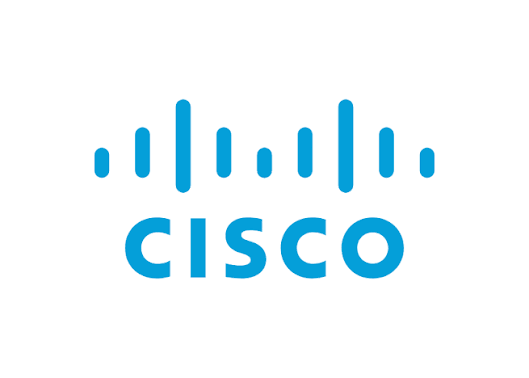

 Abraão Filipi dos Santos 

*Back-End Developer*

  
 

Estudante de Análise e Desenvolvimento de Sistemas e desenvolvedor backend. Trabalho com <b>Node.js, Flask e bibliotecas/extensões complementares</b>, aplicando arquitetura em camadas e princípios SOLID no dia a dia dos meus projetos. Atualmente, estou construindo conhecimentos em TypeScript, Docker e AWS. 

Já trabalhei em diversos projetos, mas atualmente, o principal é o **Blabry** (WIP), uma aplicação full-stack de chat e rede social que uso como vitrine técnica — do desenho do banco de dados à comunicação em tempo real via WebSockets. Meus projetos Estão no meu portfólio, desde os mais simples, até o mais completo que já desenvolvi antes do **Blabry**, exceto ele mesmo, uma vez que ainda está sendo desenvolvido.

<a style="background-color: #2579f6; color: #fff; padding: 10px 40px; font-weight: 500; text-align: center; border-radius: 5px" href="https://abraaosantosdeveloper.github.io">Acessar portfólio 🡥</a>

 
 
 ---

### 🌐 Redes Sociais
 

---

 

## 💻 Ferramentas com as quais trabalho

### Linguagens de programação

### Frameworks e Bibliotecas

### Ferramentas de documentação

### Versionamento e desenvolvimento cooperativo

### Bancos de Dados & Cloud

### Ferramentas complementares

 

## 🎓 Formação Acadêmica e Certificações

<b>Análise e Desenvolvimento de Sistemas</b> 
<i>CESAR School (3º período)</i>

<b>C fundamentals</b> 
<i>Cisco Networking Academy</i>

<b>Desenvolvimento de Sistemas</b> 
<i>SENAI</i>

 
 

## 📊 GitHub Stats

 

Feito por <b>Abraão Filipi dos Santos</b> · Atualizado em 2026

⚡ Powered by curiosidade, café e alguns bugs corrigidos às 2h da manhã
 

